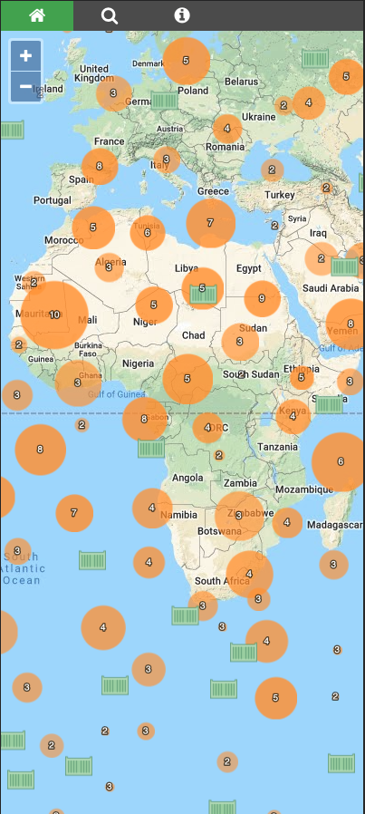
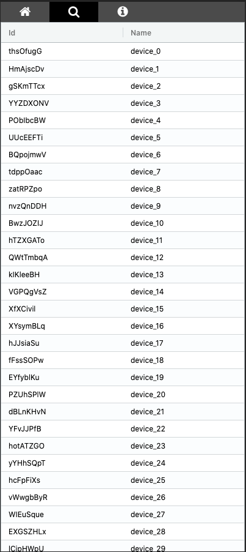

<h1 align="center">Map app using ReactJS + NestJS 💼</h1>
<p>
  
  <a href="LICENSE" target="_blank">
    
  </a>
</p>

> Monorepo with a React frontend and NestJS backend. The app is built with
> TypeScript in server and front side. 
> With this app you can see multiple devices displayed on a map grouped by
> clusters. The app is responsive and is working on mobile devices.
>

 
>The list of points displayed on the map can be looked up using a table
>

>
### Frontend stack
- [typescript](https://www.typescriptlang.org/)
- [reactjs](https://reactjs.org)
- [storybook](https://github.com/storybookjs/storybook)
- [styled-components](https://github.com/styled-components/styled-components)
- [jest](https://jestjs.io/)
- [openlayer](https://openlayers.org/)
- [aggrid](https://www.ag-grid.com/)


### Backend stack
- [nestjs](https://nestjs.com/)
- [typescript](https://www.typescriptlang.org/)

## Install

```sh
npm ci
lerna clean --yes
lerna bootstrap
```

## Start frontend

```sh
lerna exec --scope frontend -- npm run start
```
Frontend in dev mode is running in port 3000
## Start backend

```sh
lerna exec --scope backend -- npm run start
```

Backend is running in port 3333

## Docker

The app can be started using docker-compose. Running the following command 
images will be create. 
```
docker up
```
App runs in port 8080
  
## Author

👤 **David Jimenez Calvo**

* Github: [@djimenezc](https://github.com/djimenezc)
* Travis CI: (https://travis-ci.org/github/djimenezc/react-nest-map/builds) 

## Show your support

Give a ⭐️ if this project helped you!

## 📝 License

Copyright © 2020 [David Jimenez Calvo](https://github.com/djimenezc).<br />
This project is [MIT](https://github.com/djimenezc/react-nest-map/blob/master/LICENSE) licensed.

